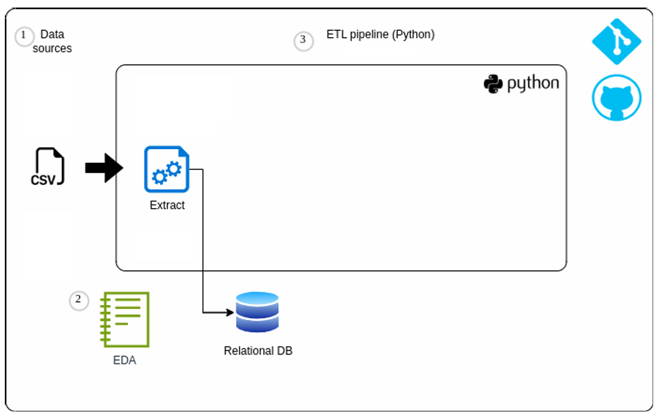

# ETL class project 

Este proyecto implica la creación de un proceso de ETL para extraer, transformar y cargar un conjunto de datos. El conjunto de datos se debe seleccionar con los siguientes criterios:
- Más de 10.000 filas
- Columnas suficientes para realizar transformaciones significativas y extraer ideas valiosas
- Usar Python
- Elija un conjunto de datos que lo motive a explorar el problema en profundidad

## Alcance entregable 1

La primera entrega del proyecto consta de estos pasos:
- Fuentes de datos: seleccione una o más fuentes de datos (por ejemplo, CSV, API, bases de datos)
- Extracción de datos: use Python para extraer los datos de la fuente y almacenarlos en una base de datos relacional
- EDA

### Entregables:
Repositorio Github con: 
- Código relevante
- Archivo README con todo el contexto, instrucciones para usar el repositorio y consideraciones
- Gitignore para incluir solo archivos relevantes en el repositorio

Documentación:
- Descripción del problema
- Contexto
- Descripción del conjunto de datos
- Proceso
- Evidencias

## Consideraciones

Utiliza base de datos posgreSQL
Desarrollado en python 3.10.9
Se recomienda usar un entorno virtual para desplegar el proyecto
El dataset seleccionado está disponible en https://www.kaggle.com/datasets/fedesoriano/electric-power-consumption
001_proyect.ipynb es el notebook donde se desarrolla el EDA.
etl.py es el pipeline ETL con las funciones necesarias para lograr el alcance 1.

## Como usar
Debes tener instalado python en tu máquina.
Debes tener instalado postgress en tu máquina.
1. Clona este repositorio.
2. Crea una cuenta en [kaggle](https://www.kaggle.com/)
3. Descarga tu llave de acceso en tu almacenamiento local (C:/USER/.kaggle/) o descarga en el dataset y usa el .csv directamente en la misma carpeta donde clonaste el repositorio (Debes comentar la línea "kaggle.api.dataset_download_files("fedesoriano/electric-power-consumption", unzip=True)" si usas el archivo directamente)
4. Instala todos los requerimientos mediante el comando "python install -r requirements"
5. Listo, puedes ejecutar el notebook 001_proyect.ipynb para validar los resultados.

## Contact

For any questions or suggestions, please contact joaquin.alarcon@uao.edu.co